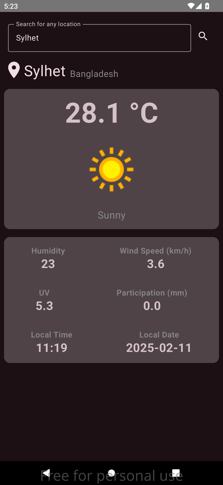
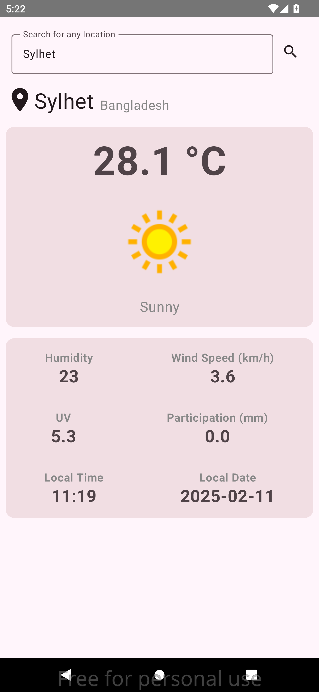

# Weather-App-Jetpack-Compose
# ☁️ Weather App

Welcome to **Weather App**, a sleek and modern weather forecasting application built entirely using **Jetpack Compose**. Stay updated with real-time weather data in both **dark** and **light** modes for a seamless user experience.

## 🔎 About This App
- **Real-Time Weather Updates**: Get the latest weather forecasts with accurate data.
- **Jetpack Compose UI**: Fully designed with Jetpack Compose for smooth and responsive user interface.
- **Dark & Light Modes**: Switch effortlessly between dark and light themes.
<!-- - **Location-Based Forecast**: Automatically fetch weather details based on your current location. -->
- **Minimal & Clean Design**: Focused on providing an intuitive user experience with minimal distractions.

## 🖼️ App Screenshots

### Dark Mode

### Light Mode

## 📥 Download the App

Click the button below to download the latest version of **Weather App**:

---

Enjoy using the **Weather App** and stay ahead of the weather anytime, anywhere! ☁️✨

